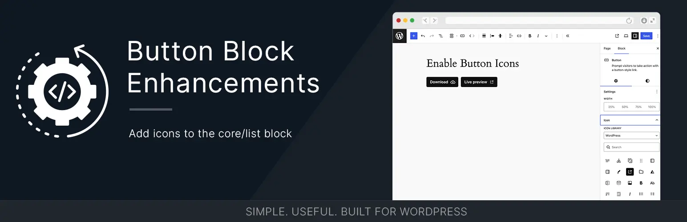

# Button Block Enhancements



[](https://wordpress.org/)
[](https://www.php.net/)
[](https://github.com/bob-moore/button-block-enhancements/releases/latest)
[](https://www.gnu.org/licenses/gpl-2.0.html)

[](https://github.com/bob-moore/button-block-enhancements/actions/workflows/phpcs.yml)
[](https://github.com/bob-moore/button-block-enhancements/actions/workflows/phpstan.yml)
[](https://github.com/bob-moore/button-block-enhancements/actions/workflows/phpunit.yml)
[](https://github.com/bob-moore/button-block-enhancements/actions/workflows/lint-css.yml)
[](https://github.com/bob-moore/button-block-enhancements/actions/workflows/lint-js.yml)

Want to give it a test drive? Try it in the WP Playground: [](https://playground.wordpress.net/?blueprint-url=https://raw.githubusercontent.com/bob-moore/button-block-enhancements/main/_playground/blueprint-github.json)

Add icons and hover/focus colors to the WordPress Button block (`core/button`) in both the editor and frontend.

## Features

### Icons

- Adds icon controls to `core/button` in the block inspector.
- Supports icon libraries:
    - WordPress icons
    - MUI icons
    - MUI variant families, including Outlined, Rounded, and Sharp
    - Custom SVG input
- Lets you set icon position (left/right).
- Lets you set icon size per button using CSS units (for example `1em`, `20px`, `1.25rem`).
- Renders sanitized inline SVG on the frontend.
- Clicking the currently selected icon removes it.

### Hover/Focus Colors

- Adds text and background color controls for hover/focus states to `core/button` in the block inspector's Color panel.
- Colors apply to `:hover`, `:focus`, and `:focus-visible` states on the frontend.
- Supports alpha channel, is clearable, and integrates with "Reset All".
- Previews live in the editor.
- Outputs CSS custom properties (`--bmd-button-focus-color`, `--bmd-button-focus-background-color`) on the button wrapper so themes can override or extend behavior.

### Architecture

- Boots through `Main`, which builds a small PHP-DI container, then resolves `Controller` to mount all WordPress hooks.
- Splits responsibilities into focused providers (`Assets`, `Icons`), transformers (`Colors`, `Icons`), and resolver services for file paths and URLs.
- Scopes bundled runtime dependencies in release zips to avoid conflicts with other plugins.
- Ships release zips with a compiled container cache, while Composer installs exclude `cache/` so host projects can decide whether to compile their own container.
- Can be embedded in other plugins or themes via Composer.

## Requirements

- WordPress 6.9+
- PHP 8.2+

## Installation

### Install as a plugin

1. Download the latest release zip from GitHub releases.
2. In WordPress admin, go to Plugins -> Add New Plugin -> Upload Plugin.
3. Upload the zip and activate Button Block Enhancements.

### Install via Composer (library usage)

If you are embedding this into your own project:

```bash
composer require bmd/button-block-enhancements
```

Then bootstrap from your plugin or theme:

```php
use Bmd\ButtonBlockEnhancements\Main;

$dependency_url  = plugin_dir_url( __FILE__ ) . 'vendor/bmd/button-block-enhancements/';
$dependency_path = plugin_dir_path( __FILE__ ) . 'vendor/bmd/button-block-enhancements/';

$plugin = new Main(
    [
        'package' => 'your_plugin_slug',
        'path'    => $dependency_path,
        'url'     => $dependency_url,
    ]
);

$plugin->mount();
```

The `path` and `url` values must point to the Button Block Enhancements dependency root, not the file where you call it. The `package` value is used for extension filters/actions so the package can inherit your parent plugin namespace when embedded. The package's own script and style handles remain fixed as `button-block-enhancements-*` to avoid collisions with the parent plugin's handles.

You may omit `path` and `url` when WordPress can resolve the dependency location automatically, but passing them explicitly is safest for Composer-embedded plugins and themes. Container compilation is only enabled automatically when `environment` is `production` and a writable package cache is available.

## Usage

### Using Icons

1. Add a Button block.
2. Open the block sidebar.
3. Open the **Icon** panel.
4. Choose an icon library (WordPress, MUI, MUI Outlined/Rounded/Sharp, or Custom SVG).
5. Pick an icon. Click it again to remove it.
6. Open the **Icon Styles** panel to set icon size and position (left/right).
7. Save and view the post.

### Using Hover/Focus Colors

1. Add a Button block.
2. Open the block sidebar.
3. Open the **Color** panel.
4. Use the **Text: Focus** and **Background: Focus** controls to pick hover/focus colors.
5. Save and view the post.

## CSS Custom Properties

The following CSS custom properties are available for theming:

| Property | Default | Description |
|---|---|---|
| `--bmd-button-icon-size` | `1em` | Icon width and height |
| `--bmd-button-icon-gap` | `0.75em` | Gap between icon and button text |
| `--bmd-button-focus-color` | — | Text color on hover/focus (set per-block) |
| `--bmd-button-focus-background-color` | — | Background color on hover/focus (set per-block) |

## Custom Icon Families

Developers can register additional static JSON icon families with the `button_block_enhancements_icon_families` filter. Each JSON file should contain an array of picker-compatible icon objects with `name`, `label`, and `source` properties.

```php
add_filter( 'button_block_enhancements_icon_families', function ( $families ) {
    $families['brand-icons'] = array(
        'label' => 'Brand Icons',
        'url'   => plugin_dir_url( __FILE__ ) . 'icons/brand-icons.json',
    );

    return $families;
} );
```

## Changelog

### 1.2.1

- Fixed a malformed package URL generated by `Utilities` in embedded contexts.
- Fixed style and script handle collisions when the package is included via Composer by hardcoding package-owned asset handles.
- Updated Composer usage documentation to bootstrap through `Main` with array config.
- Renamed render/content mutation classes from `Processors` to `Transformers`.
- Moved PHPCS, PHPStan, and PHPUnit config to root-level files and added a combined Composer `test` script.
- Added CSS and JavaScript lint GitHub workflows.
- Committed npm lockfile policy and optional dependency config so CI installs include platform-optional packages such as `fsevents`.
- Cleaned Composer export rules for root declaration files and removed the misspelled `declerations.d.ts`.

### 1.1.1

- Documented the controller/provider/transformer architecture used by the current plugin bootstrap.
- Standardized all release metadata and package versions on 1.1.1.

### 1.1.0

- Rebuilt the plugin around a focused PHP-DI controller and provider/transformer services.
- Scoped release dependencies to reduce conflicts with other plugins.
- Split editor-only styles from block styles registered against `core/button`.
- Added optional compiled container cache handling for release builds.
- Removed the legacy framework/updater architecture.
- Migrated button icon functionality from [Enable Button Icons](https://github.com/bob-moore/enable-button-icons).
- Added hover/focus color controls and CSS custom properties for icon gap, icon size, and focus colors.
